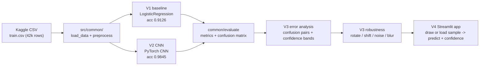

```
 __  __ _   _ ___ ____ _____
|  \/  | \ | |_ _/ ___|_   _|
| |\/| |  \| || |\___ \ | |
| |  | | |\  || | ___) || |
|_|  |_|_| \_|___|____/ |_|
```

[](https://git.io/typing-svg)


A basic MNIST digit-recognition assignment, rebuilt as four progressively deeper versions: a classical baseline, a real CNN, rigorous error/confidence/robustness analysis, and a live drawing demo. Every version is real, trained on the actual Kaggle dataset, and reproducible - not a mockup.

## Results at a glance

| Version | Focus | Model | Test accuracy |
|---|---|---|---|
| V1 | Flattened-pixel baseline | Logistic Regression | 0.9126 |
| V2 | Real computer vision model | PyTorch CNN | **0.9845** |
| V3 | Error analysis, confidence scoring, robustness testing | (evaluates V2's CNN) | n/a |
| V4 | Streamlit drawing demo | (uses V2's CNN) | n/a |

All four run on the same Kaggle "Digit Recognizer" dataset (42,000 labeled 28x28 digit images), split 80/10/10 train/val/test, `random_state=42`, held-out test set never touched during training or model selection.

### Analysis: what actually changed between V1 and V2

**V1 -> V2 is a real, substantial improvement, not noise.** Accuracy jumps from 0.9126 to 0.9845 - a 71% cut in the error rate (874 wrong out of 4,200 -> 65 wrong out of 4,200). This isn't just "CNNs are better than logistic regression" in the abstract: per-class accuracy shows *where* the improvement actually lands.

| Digit | V1 accuracy | V2 accuracy | Change |
|---|---|---|---|
| 0 | 0.9661 | 0.9903 | +0.0242 |
| 1 | 0.9679 | 0.9936 | +0.0257 |
| 2 | 0.8923 | 0.9833 | +0.0910 |
| 3 | 0.8897 | 0.9885 | +0.0988 |
| 4 | 0.9066 | 0.9877 | +0.0811 |
| 5 | 0.8474 | 0.9842 | +0.1368 |
| 6 | 0.9662 | 0.9903 | +0.0241 |
| 7 | 0.9205 | 0.9909 | +0.0704 |
| 8 | 0.8473 | 0.9483 | +0.1010 |
| 9 | 0.9093 | 0.9857 | +0.0764 |

The baseline's two weakest digits (5 and 8, both ~0.847) are exactly the digits with the most curved, overlapping stroke geometry - a flattened-pixel linear model has no way to represent "a loop here, a curve there" as a spatial pattern, it just sees 784 independent pixel intensities. The CNN's convolutional filters pick up on local stroke shapes directly, which is *why* 5 and 8 see the two largest accuracy jumps (+0.137 and +0.101).

**Digit 8 is still the CNN's weakest class (0.9483 vs. 0.99+ for most others).** V3's error analysis confirms this isn't random: the three most common mistakes are all real, systematic confusions - true `8` predicted as `5` (8 times), `3` (5 times), and `9` (4 times) out of 65 total misclassifications. These are exactly the digits that share 8's closed-loop-plus-curve structure. See `reports/error_analysis.md` and `reports/misclassified_examples.png` for the full breakdown.

### Robustness: the CNN degrades very differently under different perturbations

| Perturbation | Accuracy | Drop from baseline |
|---|---|---|
| None (baseline) | 0.9845 | - |
| Rotation (15deg) | 0.9712 | -0.0133 |
| Gaussian blur | 0.9640 | -0.0205 |
| Gaussian noise (sigma=25) | 0.9840 | -0.0005 |
| Shift (3px, both axes) | **0.3710** | **-0.6135** |

Pixel noise and mild blur barely move the needle - the CNN's learned features are genuinely robust to those. **A small positional shift is catastrophic**, dropping accuracy by 61 points. This lines up exactly with what happens in the live demo (below): the network was trained exclusively on digits that Kaggle's preprocessing already centers and normalizes, so it never learned to recognize a digit sitting in a different part of the frame - the fully-connected layers are tied to fixed spatial positions in the flattened feature map, not translation-invariant like the convolutional layers are. See `reports/robustness_results.csv`.

## Pipeline shape



## V4: live drawing demo


Draw a digit or load a real test-set sample (one example per digit 0-9), hit Predict, and the app shows a color-coded verdict banner, a confidence score with a high/medium/low band, a top-3 prediction breakdown, and the actual 28x28 image the model sees. The canvas preprocessing crops to your strokes' bounding box and re-centers by center-of-mass (matching MNIST's own convention), so small or off-center drawings work correctly - but decorative handwriting flourishes MNIST never saw during training can still trip up the model, and confidence banding surfaces that honestly with a low-confidence warning instead of a falsely-certain answer.

## Setup

This project uses [Poetry](https://python-poetry.org/) for dependency management.

```bash
poetry install
cp .env.example .env   # fill in KAGGLE_USERNAME and KAGGLE_KEY (kaggle.com -> Account -> Create New API Token)
```

## Running each version

```bash
poetry run python main.py                      # runs the full pipeline: V1 -> V2 -> V3 error analysis -> V3 robustness
poetry run python -m src.v1_baseline            # V1 only: trains/evaluates the logistic regression baseline
poetry run python -m src.v2_cnn                 # V2 only: trains/evaluates the CNN
poetry run python -m src.v3_error_analysis      # V3 only: misclassified examples + confusion analysis
poetry run python -m src.v3_robustness          # V3 only: rotation/shift/noise/blur robustness testing
poetry run streamlit run app/streamlit_app.py   # V4: the drawing demo (needs V2's CNN already trained)
```

Run the test suite anytime with:

```bash
poetry run pytest -v
```

## Repo layout

- `src/common/` - code shared across every version (config, data loading, preprocessing, evaluation harness, confidence-scored prediction)
- `src/v1_baseline.py` - the V1 logistic regression pipeline
- `src/v2_cnn.py` - the V2 PyTorch CNN pipeline
- `src/v3_error_analysis.py` / `src/v3_robustness.py` - the V3 analysis pipelines
- `app/streamlit_app.py` - the V4 drawing demo
- `main.py` - runs the full V1 -> V2 -> V3 pipeline end to end
- `reports/` - generated metrics, plots, and analysis (gitignored contents regenerate on each run)
- `models/` - gitignored trained model artifacts
- `data/` - gitignored raw/processed Kaggle data
- `tests/` - pytest unit tests

## Limitations

- Trained only on Kaggle's `train.csv` (~42k images); Kaggle's own `test.csv` has no labels and isn't used for evaluation.
- Confidence-band thresholds (0.9 / 0.6) are reasonable defaults, not empirically tuned.
- The Streamlit canvas crops to the drawn strokes' bounding box and re-centers by center-of-mass to match MNIST's own preprocessing convention (see `app/streamlit_app.py::canvas_to_28x28`), but stroke *style* still differs from real MNIST handwriting - decorative flourishes (serifs, flags) that MNIST's training data never contains can still be misread, since that's a style gap rather than a position/scale gap.

## Future improvements

- Data augmentation targeted at the most-confused digit pairs (8 vs 5/3/9).
- A deeper CNN with batch normalization/dropout.
- A "model audit assistant" that automatically summarizes `reports/` into a human-readable health check (not built in this version - noted here as a future direction only).
